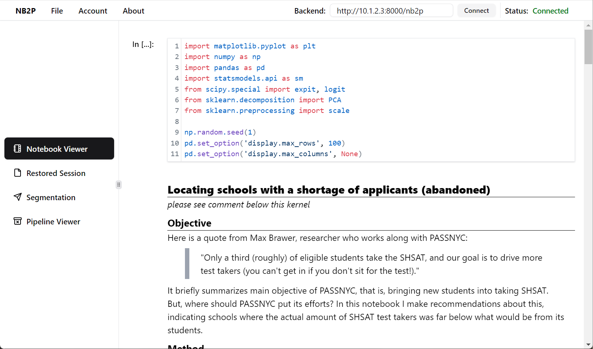
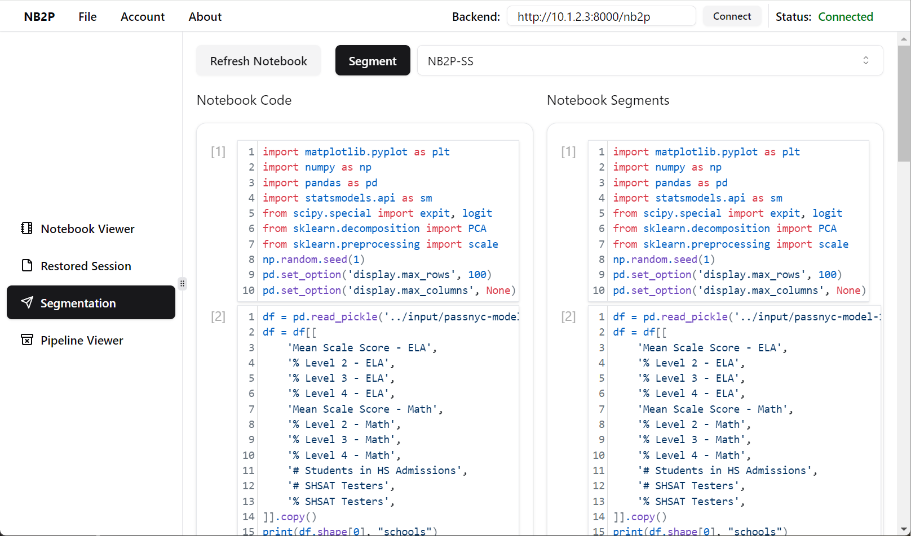
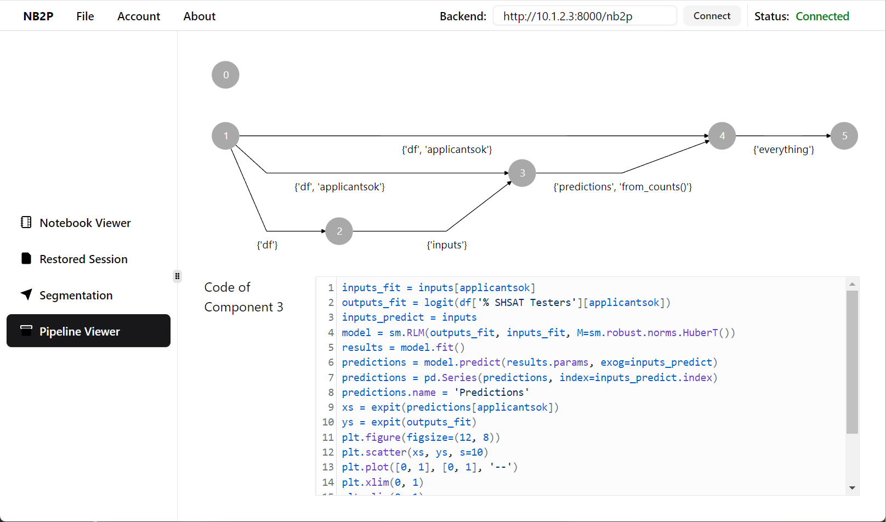

# NB2P

[](https://www.python.org/) [](https://github.com/psf/black) [](https://www.typescriptlang.org/) [](https://standardjs.com) [](https://nodejs.org/)

> Extracting Data Analytics Pipelines from Computational Notebooks

<!-- Screenshot -->

  |  | 
----------------------------------- | --------------------------------------- | -----------------------------------
Notebook Viewer                     | Segmentation                            | Pipeline Viewer

<!-- Screenshot End -->


## Overview

### Problem

Computational notebooks empower data scientists to explore data, perform analytics, and share their findings. Extracting pipelines from a given notebook is useful in understanding the notebook's semantics and in migrating it to production systems.

However, the nature of the data exploration process, and the lack of sufficient documentation in the notebook, present two challenges in extracting the pipelines:

- Notebook cells can be executed in any order, making it difficult to capture the data flow between pipeline stages.
- Data transformation operations belonging to a stage may not be cleanly separated, making it difficult to extract cohesive pipeline components.

### Solution

NB2P is a novel system that automatically extracts data science pipelines from notebooks. The extracted pipelines enable interactive semantic analysis, visualization, and other downstream tasks.

NB2P consists of modules that

- parse the Abstract Syntax Tree (AST)
- restore the execution order
- extract components
- build the pipeline

#### Segmentation Mechanism

A key component of NB2P is the _segmentation mechanism_ that extracts pipeline components based on the semantics of data transformations, grouping them into distinct stages of data analytics. This mechanism employs a novel _tree-based encoding-decoding_ method that captures the data flow and fine-grained hierarchical information of the notebook.

#### System Training

NB2P is trained on large notebook corpora from Kaggle.

## Installation

1. Install [MongoDB](https://www.mongodb.com/try/download/community) and [Anaconda](https://www.anaconda.com/download).
2. Clone/download this repo to folder `<nb2p_folder>`.
3. Create a `.env` file in `<nb2p_folder>` and write the following content. This will indicate the relative path resolving for the configuation file.

  ```sh
  NB2P_PREFIX=<nb2p_folder>
  ```

4. Open the commented configuration file `<nb2p_folder>/config.toml` and modify it to reflect the setup of your target environment. Pay special attention to the `database` settings, as the port number is not the default one (27017), which you may want to change.

5. Create the Anaconda environments. Importing from Anaconda environment file `conda-env.yml` and `conda-env-llm.yml` is recommended. Otherwise, if you want to use `pip` to install:

  ```sh
  conda create -n nb2p python=3.11
  conda create -n nb2p-llm python=3.10

  # Go to `<nb2p_folder>`

  conda activate nb2p
  pip install -r requirements.txt
  conda activate nb2p-llm
  pip install -r requirements-llm.txt
  ```

6. Build and install `nb2p` Python package in editable mode.

  ```sh
  python -m build
  pip install -e .
  ```

7. Go to `<nb2p_folder>/jupyter` and check the subfolders to execute scripts and notebooks. Some utility scripts are provided in `<nb2p_folder>/scripts`.


### Dataset

Our training dataset for NB2P is created from DistilKaggle. Please follow the listed procedure to get the dataset:

1. Download the dataset from the [DistilKaggle](https://zenodo.org/records/10317389) repository.
2. Decompress the file into `<prefix>` folders, with the corresponding `<prefix>` indicated in the configuration file.
3. Run scripts/notebooks in `jupyter/01-create-dataset` and `jupyter/02-encoding`.


## Development

### Folder Structure

#### Core

- `nb2p`: The package source. This includes most core models and logic.
- `jupyter`: The Jupyter Notebooks containing the code performing the steps of the NB2P workflow and the experimental studies, ordered with number prefix `XX-`. It contains the main code to reproduce the experimental result.

#### Web GUI

(may not reflect the latest version)

- `web`: The Web GUI frontend
- `backend`, `webapi`, and `webcommon`: The Web GUI backend.

#### Others

- `build`: Pre-built binaries of [tree-sitter](https://tree-sitter.github.io/tree-sitter/) parser (used to generate AST for notebook sessions).
- `scripts`: Some utility scripts such as notebook and AST (S expression) printers.
