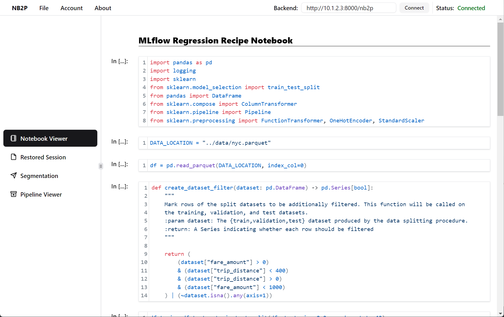
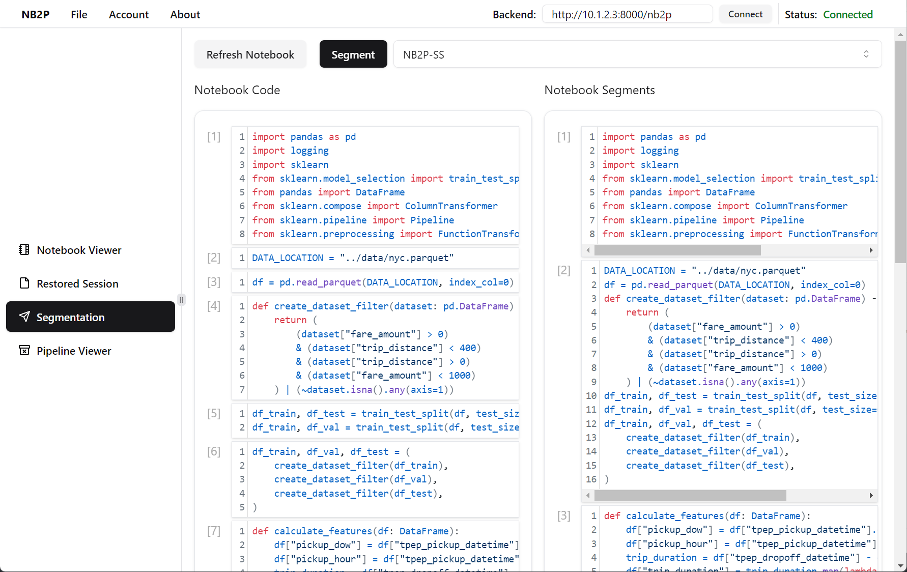
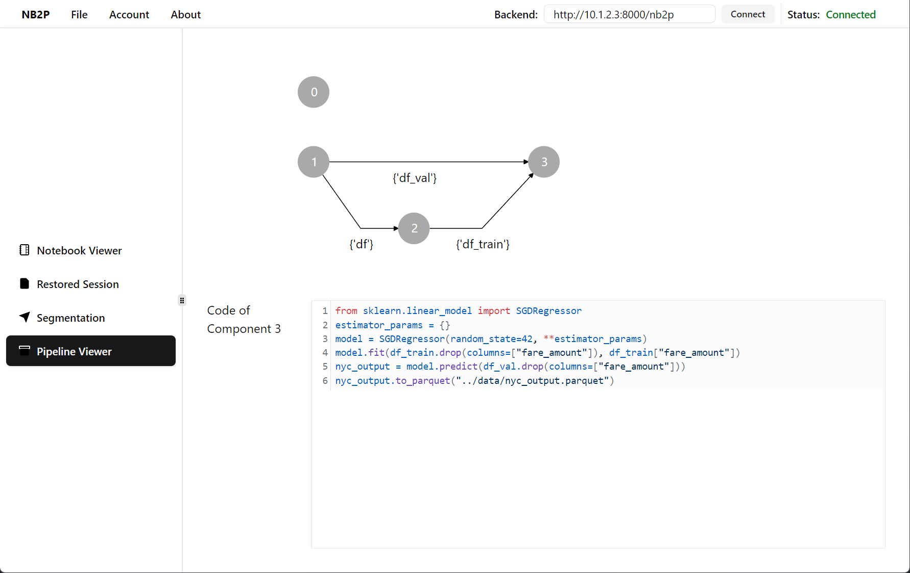
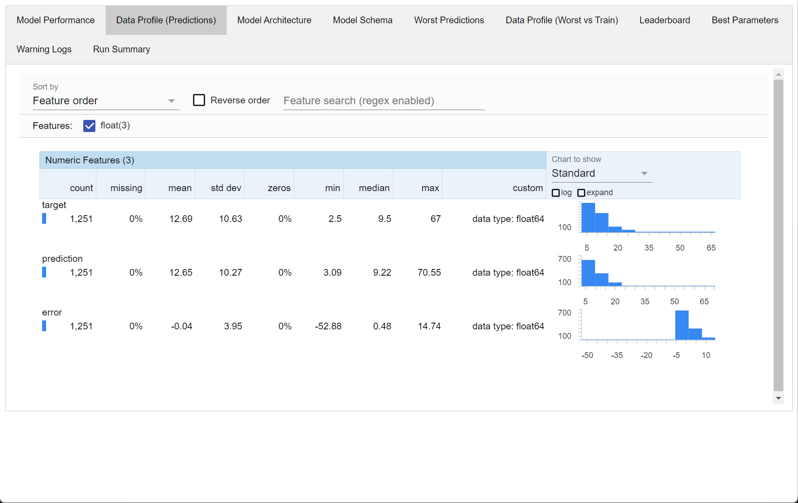
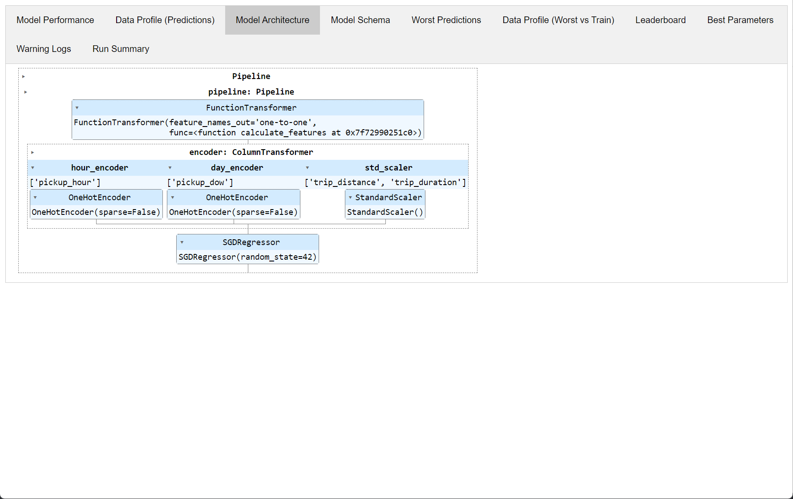
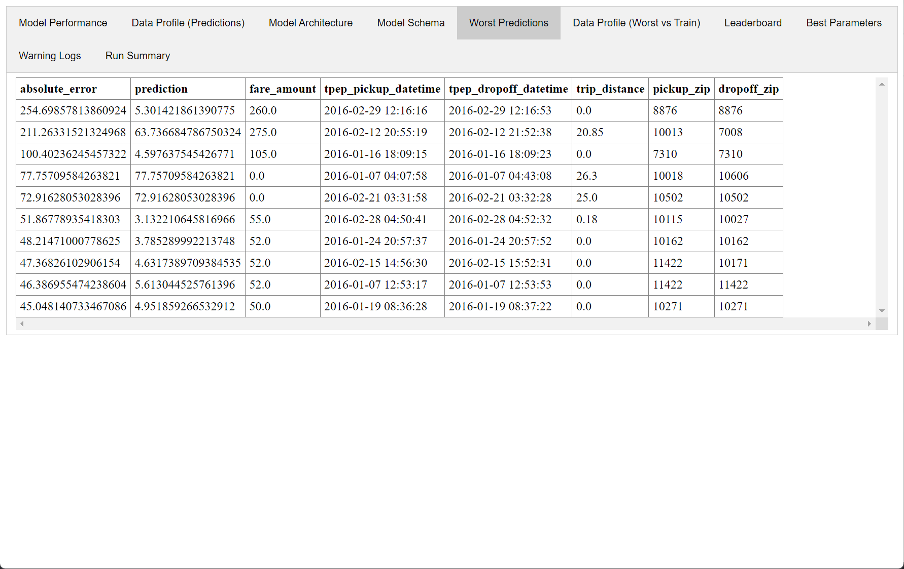
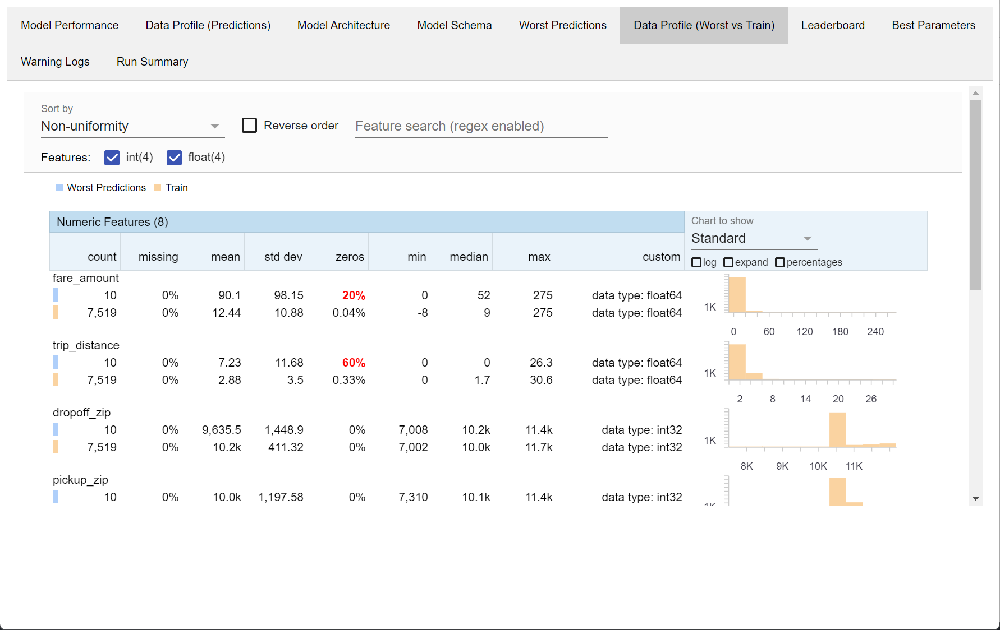
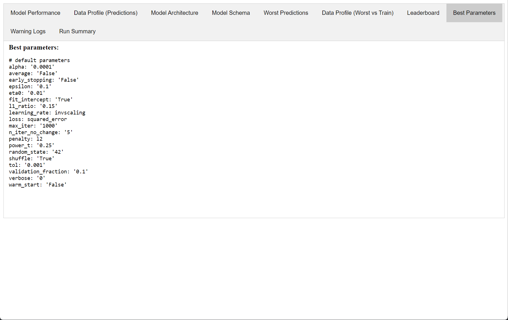
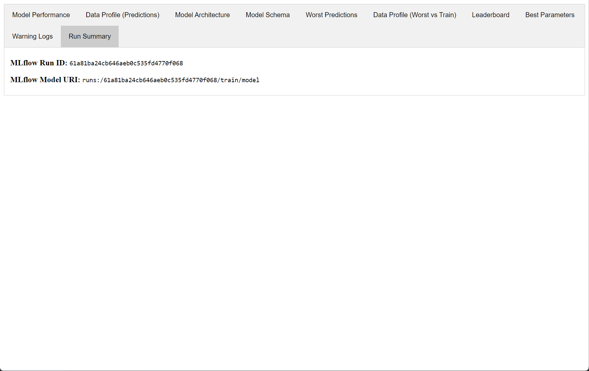

# Deployment Example: NYC

This example uses the code provided by [MLflow Recipes](https://mlflow.org/docs/latest/recipes.html).

The result is deployed on MLflow server and can be tracked by its Python APIs or `mlflow recipes` CLI commands.

## Folder Structure

### Input

- `data`: The data used by the notebook.
- `notebooks`: The notebooks to construct deployed pipeline.

### Output

- `nb2p_output`: Output pipeline structure from NB2P.
- `mlflow_autogen`: The (auto-generated) MLflow Recipe.
  - `metadata`: The step cards (in HTML format) with interactive pipeline execution log.
- `mlruns`: Metadata for MLflow server.

## Screenshots

### NB2P Execution Process

### MLflow Recipes Execution Step Card

